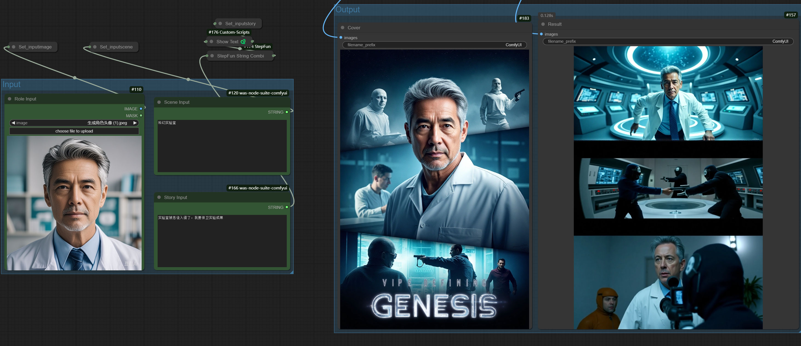
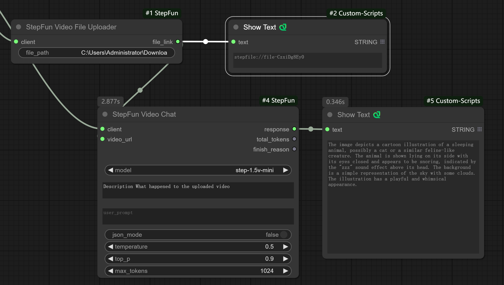

# ComfyUI StepFun Nodes

This is a collection of ComfyUI custom nodes based on the [StepFun](https://platform.stepfun.com/) API. These nodes enable easy implementation of intelligent analysis and processing for images and videos.
Currently, video upload is not implemented, and video URL links are required.
> 🚧 **More nodes are being updated...**

## Key Features

- 🖼️ Image Content Understanding and Analysis
- 🎬 Video Content Understanding and Analysis
- ✨ Intelligent Prompt Generation
- 💰 Cost-effective API Pricing
- 🚀 Cloud Processing without Local GPU Resources

## Installation

1. Clone this repository to your ComfyUI's `custom_nodes` directory:
```bash
cd custom_nodes
git clone https://github.com/your-repo/ComfyUI_StepFun.git
```

2. Install dependencies:
```bash
cd ComfyUI_StepFun
pip install -r requirements.txt
```

## API Key Configuration

1. Register an account at [StepFun Platform](https://platform.stepfun.com/account-overview)
2. Get your API key from the account overview page
3. Add the API key to the configuration file

## Usage

### Example Workflows

The following examples are provided in the `workflow` folder:

#### Role2Story Workflow
- File: `workflow/role2story.json`
- Features: By inputting character/scene/story descriptions, automatically generate:
  - 🎨 Theme Poster
  - 🎬 Three Key Plot Shots
- This workflow demonstrates the model's content understanding and intelligent prompt generation capabilities



#### Video Caption Workflow
- File: [workflows/StepFunVideo2Caption.json](workflows/StepFunVideo2Caption.json)
- Features:
  - 📽️ Native Video Upload Support
  - 📝 Automatic Video Caption Generation
  - 🤖 Intelligent Video Content Analysis

> 🚧 **More workflow examples are being updated...**

## Supported Features

- Image Content Recognition and Description
- Video Scene Analysis
- Intelligent Prompt Generation
- Native Video Upload Support
- [Other Features]

## Video Processing Guide

### Native Video Upload
You can now use the `StepFun Video File Uploader` node for direct video uploads. Simply provide the absolute path to your video file (e.g., `C:\Users\Administrator\Downloads\test.mp4`). The node will return a `stepfile://file-id` string that can be used as input for the `video_url` parameter in the `StepFun Video Chat` node.



### Video File Processing with FFmpeg
For videos larger than 128MB or in different formats, you can use FFmpeg for preprocessing:

#### Splitting Video Files
To split a large video into smaller segments (120-second chunks):
```bash
ffmpeg -i sample.mp4 -acodec copy -f segment -segment_time 120 -vcodec copy -reset_timestamps 1 -map 0 output_time_%d.mp4
```

#### Converting to MP4 Format
To convert videos from other formats to MP4:
```bash
ffmpeg -i sample.mkv -codec copy sample.mp4
```

> Note: It's recommended to compress videos before uploading for better performance.

## Notes

- API calls require internet connection
- Ensure correct API key configuration
- Comply with API usage limits and terms

## Contact

- Email: 3354405250@qq.com
- [Other Contact Methods]

If you encounter any issues while using this project, please feel free to contact us through the above methods.
