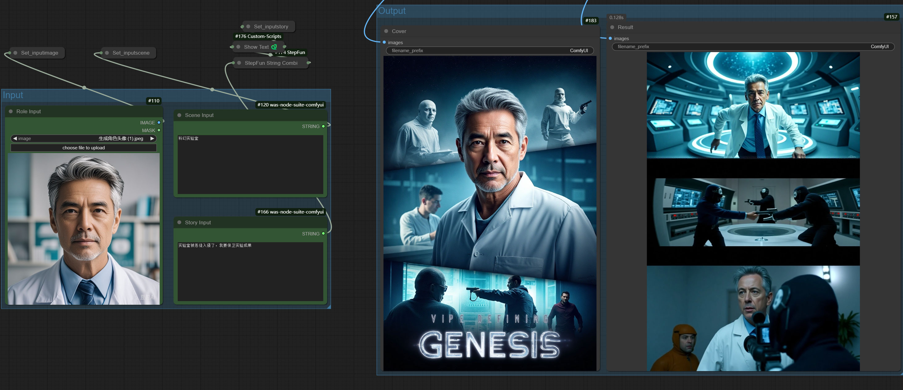

# ComfyUI StepFun 节点

这是一个基于 [StepFun](https://platform.stepfun.com/) API 的 ComfyUI 自定义节点集合。这些节点可以轻松实现图像和视频的智能分析和处理。
目前尚未实现视频上传功能，需要使用视频 URL 链接。
> 🚧 **更多节点正在更新中...**

## 主要特点

- 🖼️ 图像内容理解和分析
- 🎬 视频内容理解和分析
- ✨ 智能提示生成
- 💰 经济实惠的 API 定价
- 🚀 无需本地 GPU 资源的云端处理

## 安装

1. 将此仓库克隆到你的 ComfyUI 的 `custom_nodes` 目录：
```bash
cd custom_nodes
git clone https://github.com/your-repo/ComfyUI_StepFun.git
```

2. 安装依赖：
```bash
cd ComfyUI_StepFun
pip install -r requirements.txt
```

## API 密钥配置

1. 在 [StepFun 平台](https://platform.stepfun.com/account-overview) 注册账号
2. 从账户概览页面获取 API 密钥
3. 将 API 密钥添加到配置文件中

## 使用方法

### 工作流示例

在 `workflow` 文件夹中提供了以下示例：

#### Role2Story 工作流
- 文件：`workflow/role2story.json`
- 功能：通过输入角色/场景/故事描述，自动生成：
  - 🎨 主题海报
  - 🎬 三个关键情节镜头
- 此工作流展示了模型的内容理解和智能提示生成能力



#### 视频字幕工作流
- 文件：[workflows/StepFunVideo2Caption.json](workflows/StepFunVideo2Caption.json)
- 功能：
  - 📽️ 原生视频上传支持
  - 📝 自动视频字幕生成
  - 🤖 智能视频内容分析

> 🚧 **更多工作流示例正在更新中...**

## 支持的功能

- 图像内容识别和描述
- 视频场景分析
- 智能提示生成
- 原生视频上传支持
- [其他功能]

## 视频处理指南

### 原生视频上传
现在你可以使用 `StepFun Video File Uploader` 节点进行直接视频上传。只需提供视频文件的绝对路径（例如：`C:\Users\Administrator\Downloads\test.mp4`）。该节点将返回一个 `stepfile://file-id` 字符串，可用作 `StepFun Video Chat` 节点中 `video_url` 参数的输入。


### 使用 FFmpeg 处理视频文件
对于大于 128MB 或不同格式的视频，你可以使用 FFmpeg 进行预处理：

#### 分割视频文件
将大视频分割成较小的片段（120秒一段）：
```bash
ffmpeg -i sample.mp4 -acodec copy -f segment -segment_time 120 -vcodec copy -reset_timestamps 1 -map 0 output_time_%d.mp4
```

#### 转换为 MP4 格式
将其他格式的视频转换为 MP4：
```bash
ffmpeg -i sample.mkv -codec copy sample.mp4
```

> 注意：建议在上传前压缩视频以获得更好的性能。

## 注意事项

- API 调用需要互联网连接
- 确保正确配置 API 密钥
- 遵守 API 使用限制和条款

## 联系方式

- 邮箱：3354405250@qq.com
- [其他联系方式]

如果您在使用本项目时遇到任何问题，请随时通过以上方式与我们联系。
